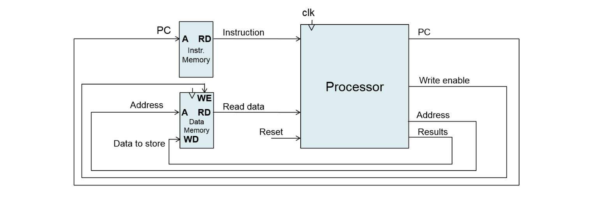

# Microarchitecture RISC-V ISA

Design a simple 32-bit processor (with Verilog) connected to a separate instruction and data memory and write a program (which must work on implemented processor) that will loop through an array of numbers and determine if the given number is prime. The processor has to implement instructions given in the table bellow. Suppose that the processor starts the execution from the beginning of instruction memory (0x00000000).

| Instruction | Syntax | Operation |
|---|---|---|
| add | add rd, rs1, rs2 | rd ← [rs1] + [rs2]; |
| addi | addi rd, rs1, imm11:0 | rd ← [rs1] + imm11:0; |
| and | and rd, rs1, rs2 | rd ← [rs1] & [rs2]; |
| sub | sub rd, rs1, rs2 | rd ← [rs1] - [rs2]; |
| slt | slt rd, rs1, rs2 | if [rs1] < [rs2] then rd←1; else rd←0; |
| div | div rd, rs1, rs2 | rd ← [rs1] / [rs2]; |
| rem | rem rd, rs1, rs2 | rd ← [rs1] % [rs2]; |
| beq | beq rs1, rs2, imm12:1 | if [rs1] == [rs2] go to [PC]+{imm12:1,'0'}; else go to [PC]+4; |
| blt | blt rs1, rs2, imm12:1 | if [rs1] < [rs2] go to [PC]+{imm12:1,'0'}; else go to [PC]+4; |
| lw | lw rd, imm11:0(rs1) | rd ← Memory[[rs1] + imm11:0] |
| sw | sw rs2, imm11:0(rs1) | Memory[[rs1] + imm11:0] ← [rs2]; |
| lui | lui rd, imm31:12 | rd ← {imm31:12,'0000 0000 0000'}; |
| jal | jal rd, imm20:1 | rd ← [PC]+4; go to [PC] +{imm20:1,'0'}; |
| jalr | jalr rd, rs1, imm11:0 | rd ← [PC]+4; go to [rs1]+imm11:0; |
| auipc | auipc rd, imm31:12 | rd ← [PC] + {imm31:12,'0000 0000 0000'}; |
| sll | sll rd, rs1, rs2 | rd ← [rs1] << [rs2]; |
| srl | srl rd, rs1, rs2 | rd ← (unsigned)[rs1] >> [rs2]; |
| sra | sra rd, rs1, rs2 | rd ← (signed)[rs1] >> [rs2]; |

### Instruction encoding:

Each instruction is encoded in 32 bits (in the table from msb towards lsb), where rs1, rs2 and rd are encoded in 5 bits. Very last column of the table represents Opcode of the instruction.

add | 0000000 rs2 rs1 000 rd 0110011 | R-type
addi | imm[11:0] rs1 000 rd 0010011 | I-type
and | 0000000 rs2 rs1 111 rd 0110011 | R-type
sub | 0100000 rs2 rs1 000 rd 0110011 | R-type
slt | 0000000 rs2 rs1 010 rd 0110011 | R-type
div | 0000001 rs2 rs1 100 rd 0110011 | R-type
rem | 0000001 rs2 rs1 110 rd 0110011 | R-type
beq | imm[12|10:5] rs2 rs1 000 imm[4:1|11] 1100011 | SB-type
blt | imm[12|10:5] rs2 rs1 100 imm[4:1|11] 1100011 | SB-type
lw | imm[11:0] rs1 010 rd 0000011 | I-type
sw | imm[11:5] rs2 rs1 010 imm[4:0] 0100011 | S-type
lui | imm[31:12] rd 0110111 | U-type
jal | imm[20|10:1|11|19:12] rd 1101111 | UJ-type
jalr | imm[11:0] rs1 000 rd 1100111 | I-type
auipc | imm[31:12] rd 0010111 | U-type
sll | 0000000 rs2 rs1 001 rd 0110011 | R-type
srl | 0000000 rs2 rs1 101 rd 0110011 | R-type
sra | 0100000 rs2 rs1 101 rd 0110011 | R-type

### Program

Write a program that will loop through an array of numbers and determine if the given number is prime. If there is a prime number in the given position in the array, it overwrites this value to 1, otherwise to 0. The program must repeatedly call the prime routine, which accepts 1 argument: the tested number. In C, a function with the following prototype would correspond to this routine:

int prime(unsigned int number);
The routine returns 1 if "number" is a prime number. Consider 2 as the smallest prime number. Use the RISC-V calling convention.

Assume that information about the size of the array and its starting address are fixed at addresses in data memory

0x00000004: array size (number of items)
0x00000008: pointer to starting address of the array
That is reading the value stored at address 0x00000008 will give you the address where the first element of the array starts.

The program can only modify the array itself, and any modification of the array is considered an answer to the primeness test, i.e. do not put auxiliary data in the array.

You can assume that "number" is always less than 1000. The size of the instruction memory is limited to 128 words, i.e. 512 B. Consequence: a program exceeding this limit will not be accepted.
